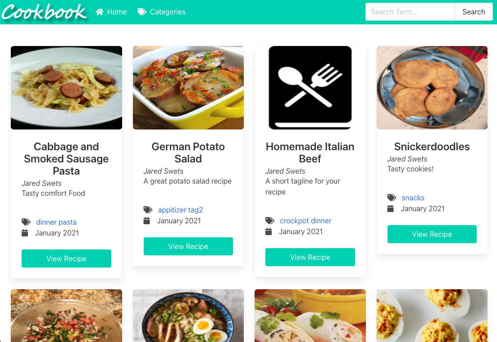
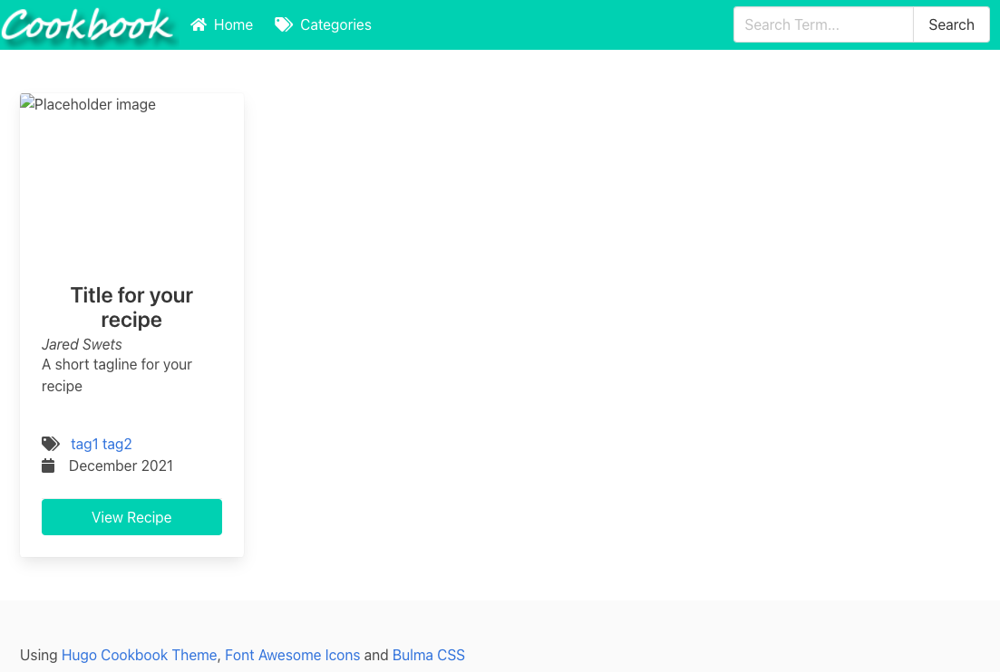
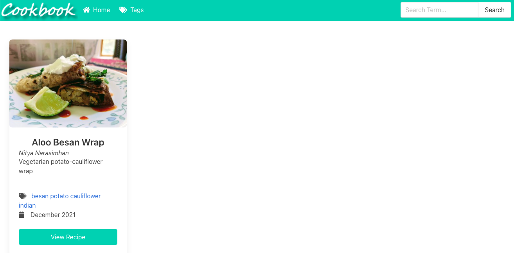
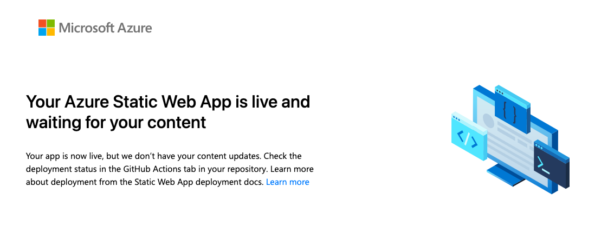
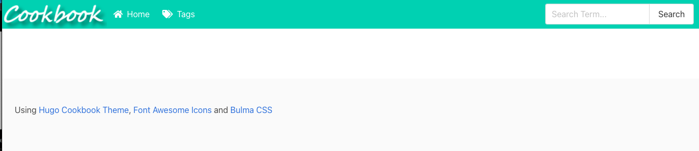
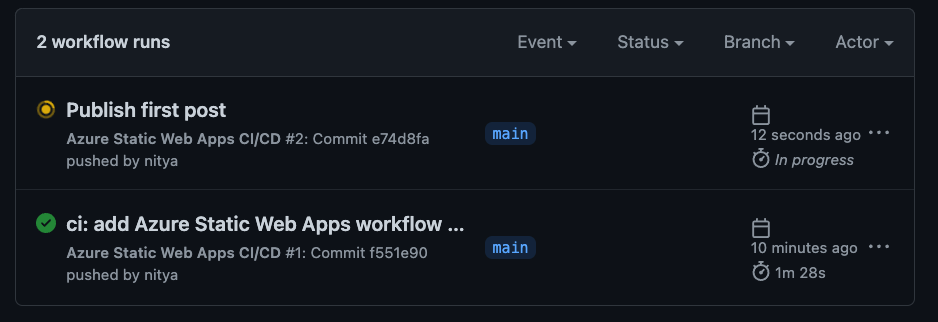
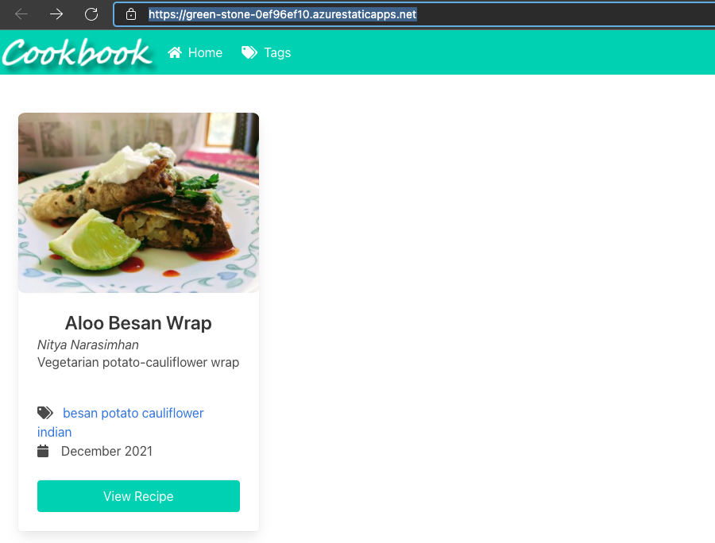

# Recipes4AJ: Demo Site using Azure Static Web Apps with Hug

I've used Hugo in the past to setup static blog sites on GitHub Pages like [this one](https://bit.ly/learn-playwright)) using the Cupper theme (as documened in [this gist](https://gist.github.com/nitya/51905082cfad7682bdf31bc8a36f5553)). But I wanted to explore using Hugo with [Azure Static Web Sites](https://docs.microsoft.com/en-us/azure/static-web-apps/) for two reasons:
 * Take advantage of [built-in benefits](https://docs.microsoft.com/en-us/azure/static-web-apps/overview#key-features) like GitHub CI/CD, free SSL certifications and easy serverless integrations with Azure Functions.
 * Have a static web app that I could use as a sandbox to explore other web development tools and technologies including end-to-end testing with [Playwright](https://playwright.dev) using a blogging framework I was familiar with.

---

## 1. My Demo App: Recipes4AJ

Over the past couple of years I've posted tweet-sized recipes under the hashtags [#Recipes4AJ](https://twitter.com/search?q=recipes4AJ&src=typeahead_click&f=live) or [#RecipesForAJ](https://twitter.com/search?q=recipesForAJ&src=typed_query&f=live). They were meant to be a fun way to share recipes for my now-teenage son to look back upon (and hopefully learn from) so he can continue to explore traditional cuisines.

And then there are the [#30Days](https://twitter.com/nitya/status/1145861567730388992) of self-care sprints where I create and share images of salads I make every morning, as a way to establish healthy eating routines when I need to reset my dietary habits.

So I thought: why not host these on a static web site. There are a couple of cookbook-inspired themes out there that I want to check out:
 * [Hugo-Cookbook](https://github.com/deranjer/hugo-cookbook)
 * [GoChowdown](https://github.com/seanlane/gochowdown)

The second one is more mature, but the first one looks kinda fun, so let's go with that!


---

## 2. Azure Static Web Apps With Hugo

The Azure Static Web Apps docuementation has a [tutorial](https://docs.microsoft.com/en-us/azure/static-web-apps/publish-hugo) tp publish a Hugo Site to ASWA. I'm going to follow the same instructions, but with a minor twist to use this new theme. Let's go!

### 2.1 Install Hugo

If not previously installed, follow the [quickstart](https://gohugo.io/getting-started/quick-start/) guidance. I use Homebrew on my MacBooKPro - so went with this:

```
$ brew install hugo
$ hugo version
hugo v0.88.1+extended darwin/amd64 BuildDate=unknownBuildDate=unknown
```

---

### 2.2 Create New Blog site

This creates the folder with the blog source and scaffolds out the 


```
$ hugo new site blog

Congratulations! Your new Hugo site is created in <..>/blog.

Just a few more steps and you're ready to go:

1. Download a theme into the same-named folder.
   Choose a theme from https://themes.gohugo.io/ or
   create your own with the "hugo new theme <THEMENAME>" command.
2. Perhaps you want to add some content. You can add single files
   with "hugo new <SECTIONNAME>/<FILENAME>.<FORMAT>".
3. Start the built-in live server via "hugo server".
```

The created folder contains the following elements:

```
$ ls blog
archetypes      config.toml     content         data            layouts         static          themes
```

The main things to know are:
 * `config.toml` contains configuration information
 * `content/` is where blog posts should get created
 * `static/` is where static assets (e.g., images) should go
 * `themes/` is where your selected theme is installed

---

### 2.3 Initialize Git repo

We'll add a theme soon, but first, initialize a git repo in that folder following [tutorial](https://docs.microsoft.com/en-us/azure/static-web-apps/publish-hugo) instructions.

```
// Change to blog directory
$ cd blog/

// Initialize Git repo
$ git init

// Ensure branch is named 'main'
$ git branch -M main
```
---

### 2.4 Add Hugo Theme

I'm going to try using the [hugo-cookbook](https://github.com/deranjer/hugo-cookbook) theme.

```
// Make sure you are in the blog directory
$ pwd
<..>/blog

// Add the theme 
$ git submodule add https://github.com/deranjer/hugo-cookbook.git themes/cookbook

```

You can test the theme using the example site provided to see what this looks like:

```
$ cd themes/cookbook/exampleSite 
$ hugo server --themesDir ../..

Start building sites … 
hugo v0.88.1+extended darwin/amd64 BuildDate=unknown

                   | EN  
-------------------+-----
  Pages            | 49  
  Paginator pages  |  0  
  Non-page files   |  0  
  Static files     | 21  
  Processed images |  0  
  Aliases          |  0  
  Sitemaps         |  1  
  Cleaned          |  0  

Built in 25 ms
Watching for changes in ~/aswa-hugo-demo/blog/themes/cookbook/{archetypes,exampleSite,layouts,static}
Watching for config changes in <..>/blog/themes/cookbook/exampleSite/config.toml
Environment: "development"
Serving pages from memory
Running in Fast Render Mode. For full rebuilds on change: hugo server --disableFastRender
Web Server is available at http://localhost:1313/ (bind address 127.0.0.1)
Press Ctrl+C to stop
```

Here is what I see:



---

### 2.5 Customize and Configure Theme

Follow the [instructions for your theme setup](https://github.com/deranjer/hugo-cookbook#copy-site-config)

```
// Return to the blog root directory
$ cd <..>/blog/

// Copy the example site's config.toml
$ cp themes/cookbook/exampleSite/config.toml . 

// Test default blog now (new with config)
$hugo server -D
```

This is what the blog looks like with just config setup:


Now add the [default template](https://github.com/deranjer/hugo-cookbook#setup-default-template) to support the recipe format:

```
$ cp themes/cookbook/archetypes/default.md archetypes/.     
```

This doesn't change anything on the blog (yet) but lets you create content using the recipe format.

---

### 2.6 Create your first content item

Follow the guidance to [create your first recipe](https://github.com/deranjer/hugo-cookbook#first-recipe), where the markdown file name is a hyphenated form of the Recipe name.

```
$ hugo new aloo-besan-wrap.md
```
This creates the markdown file in the `content/` directory and refreshes your blog (if running locally). If you make no changes to the markdown, this is what you see:



Fix the issues by updating the markdown (e.g., for title, date, tags, image) and updating the `config.toml` file to reflect your desired site name and author. 





---

### 2.7 Commit Changes

Let's get back to the [ASWA Tutorial](https://docs.microsoft.com/en-us/azure/static-web-apps/publish-hugo) and  first commit these changes:

```
$ git add -A
$ git commit -m "Initial Commit: Cookbook theme"
[main (root-commit) ed2354c] Initial Commit: Cookbook theme
 7 files changed, 158 insertions(+)
 create mode 100644 .gitmodules
 create mode 100644 archetypes/default.md
 create mode 100644 config.toml
 create mode 100644 content/aloo-besan-wrap.md
 create mode 100644 static/images/aloo-besan-wrap-1.jpeg
 create mode 100644 static/images/defaultImage.jpg
 create mode 160000 themes/cookbook
```
---

### 2.8 Push to GitHub

Then push them to GitHub by first creating a blank repo using [https://github.com/new](https://github.com/new) without a README.

I created [aswa-hugo-recipes4aj](https://github.com/nitya/aswa-hugo-recipes4aj) as my repository.

Now added that GitHub repo as the remote to my local repo and pushed it up to GitHub:

```
$ git remote add origin https://github.com/nitya/aswa-hugo-recipes4aj
$ git push --set-upstream origin main
```

If you use [VS Code](https://code.visualstudio.com/) as your default editor (like I do) then this process is painless. A couple of clicks to authenticate - and you're done!

---

### 2.9 Deploy your web app

Let's continue the [ASWA Tutorial](https://docs.microsoft.com/en-us/azure/static-web-apps/publish-hugo#deploy-your-web-app) to deploy this app to a production environment!

You need an Azure account and subscription for this - you can [create a free account here](https://azure.microsoft.com/free/) and learn about [what products you can access for free for 12 months](https://azure.microsoft.com/en-us/free/apps/search/)). You can also learn about [ASWA Pricing Options](https://azure.microsoft.com/en-us/pricing/details/app-service/static/) for the long term - it's free for personal/hobby projects - with some storage and custom domain limits.

 * Navigate to your [Azure Portal](https://portal.azure.com/#home).
 * Select `Create a Resource`
 * Search for `Static Web App` - select Create.
 * Fill in the `Basics` tab - select the default subscription, create the desired resource group ("my-hugo-group") and name ("recipes-for-aj"), with "free" plan and hosting on "GitHub".
 * Select "Sign in with GitHub" and authenticate
 * Fill in `Build Details` with GitHub repo information and select `Hugo` for Build Presets.
 * Click "Review + Create" - verify details.
 * Now click "Create" - wait for `Your deployment is complete` confirmation.
 * Click "Go to Resource" - click on the URL for the [deployed site](https://green-stone-0ef96ef10.azurestaticapps.net/).

You may see something like this while the site builds:
 

And then something like this when it is done:



But wait - where's that blog post I had?

---

### 2.10 Test the GitHub Actions Workflow

By default, we've got the first post in draft mode (`draft: true`) - and the default Hugo workflow publishes only articles that have `draft: false`).

Let's go into the repo and update that tag to "true". This should automatically kickoff the GitHub actions workflow to rebuild and publish the site - check status on the [Actions](https://github.com/nitya/aswa-hugo-recipes4aj/actions) tab of your GitHub repo.

Wait till the publish action completes - here is what I see when the action kicks off.



Once that action shows the green check-mark - visit the deployed site again - et voila! Our Hugo-themed recipe cookbook site is live and up for business on Azure Static Web Sites!



Now that's what I can .. "a wrap!"

---

### 2.11 Integrate Playwright E2E Testing Workflow

[Playwright](https://playwright.dev/) is an open-source framework that enables reliable end-to-end testing for modern web applications. You can use [`create-playwright`](https://github.com/microsoft/create-playwright) to initialize and configure Playwright with a single command - a handy way to setup end-to-end testing within an existing project. 

One benefit of this workflow is that it also creates (optionally) the GitHub actions workflow required to initialize and run those tests on a required cadence (e.g., with every commit).

Here's how we set this up.

```
$ cd blog/
$ npm init playwright   

Need to install the following packages:
  create-playwright
Ok to proceed? (y) y
Getting started with writing end-to-end tests with Playwright:
Initializing project in '.'
✔ Do you want to use TypeScript or JavaScript? · JavaScript
✔ Where to put your end-to-end tests? · tests
✔ Add a GitHub Actions workflow? (Y/n) · true
Initializing NPM project (npm init -y)…
Wrote to ../aswa-hugo-recipes4aj/package.json:
...
...

Installing Playwright Test (npm install --save-dev @playwright/test)…

added 191 packages, and audited 192 packages in 7s

16 packages are looking for funding
  run `npm fund` for details

found 0 vulnerabilities
Downloading browsers (npx playwright install)…
Writing playwright.config.js.
Writing .github/workflows/playwright.yml.
Writing tests/example.spec.js.
Writing package.json.
✔ Success! Created a Playwright Test project at <..>/aswa-hugo-recipes4aj
```

The project is now configured to run Playwright tests. The default test file will be found in `tests/example.spec.js` - I updated it to reflect the current site as follows:

```js
// @ts-check
const { test, expect } = require('@playwright/test');

test('basic test', async ({ page }) => {
  await page.goto('https://bit.ly/recipes-for-aj');
  await expect(page).toHaveTitle("Recipes 4 AJ");

  await page.locator('text=View Recipe').click();
});
```

This basic test opens the static web app site, checks that the title metadata is set to "Recipes 4 AJ" and clicks on the "View Recipe" button associated with the default card.

Commit the changes to the repo and let's see what happens.

---

## 3. Where to Next?

Of course, you can just treat this as a content site and publish posts to it. But why not explore other integrations or tools? Some things I hope to try out:

 * [Add an API](https://docs.microsoft.com/en-us/azure/static-web-apps/add-api?tabs=vanilla-javascript) - add a serverless API powered by [Azure Functions](https://docs.microsoft.com/en-us/azure/azure-functions/functions-overview).
 * [Get Application Insights](https://docs.microsoft.com/en-us/azure/static-web-apps/monitor) to monitor app usage and failures.
 * [Explore PWA Readiness](https://www.pwabuilder.com/) of the app, and fix issues.
 * [Explore Playwright integration](https://playwright.dev/) for end-to-end testing - watch [this video](https://docs.microsoft.com/en-us/events/learn-tv-static-web-apps-code-to-scale/end-to-end-testing-with-playwright).


Let's Get Cooking!

---

## 4. Troubleshooting

I'll use this section to track any a-ha moments related to using Hugo-themed static web sites with Azure Static Web Apps.

> 1. Configuring base URL

Make sure you change the baseURL in the config.toml to point to the URL for your static web site deployment. The default is [this user-unfriendly url](https://green-stone-0ef96ef10.azurestaticapps.net/) which I am using for now - but a future step is to move to [using a custom domain](https://docs.microsoft.com/en-us/azure/static-web-apps/custom-domain?tabs=azure-dns) and taking advantage of the additional benefits provided in the process - at which point I'll update that baseURL again.

